# Run tSQLt Unit Tests

## Description

With this build task, besides running tSQLt Unit Tests on a SQL Database, you'll also be able to:
* Export the test results to the build summary;
* Export the code coverage report to the build summary.

Originally, there is no build task that does all those 3 tasks. Thinking from an automation and engineering perspective, once you run your unit tests, it would be good to have its results published somewhere to inspect and adapt your tests.

This task relies on 3 components:

### SQLCover

Link: https://github.com/GoEddie/SQLCover

This is an Open Source component written by [Ed Elliot](https://github.com/GoEddie) to extract code coverage from a tSQLt test execution.

### OpenCover to Cobertura Converter

Link: https://github.com/danielpalme/OpenCoverToCoberturaConverter

An Open Source tool written by [Daniel Palme](https://github.com/danielpalme) to convert OpenCover code coverage reports to Cobertura, a coverage report supported by Azure DevOps. See more [here](https://docs.microsoft.com/en-us/azure/devops/pipelines/tasks/test/publish-code-coverage-results?view=vsts).

### Report Generator

Link: https://github.com/danielpalme/ReportGenerator

[Daniel Palme]() also wrote a tool to convert XML Code Coverage reports into human readable reports in various formats.

## Flow

Basically, this extension performs the following tasks, in order:

* Run tSQLt using SQLCover;
* Exports the test results using TSQL Script;
* Save Stored Procedures source files for generating the Code Coverage report;
* Converts the Open Cover XML report into human readable report using Report Generator;

## Preview

This extension is still in preview to gather information on using, feedback and tracking initial issues.

## How to use it

### Add the Run tSQLt Unit Tests build task to your pipeline

Search for `tsqlt` and make sure to add the task to your pipeline:

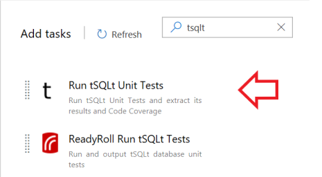

#### General configuration

The only important thing here is to highlight that the working directory for the task will be the build sources directory. You can change this but it's recommended to keep it as it is.

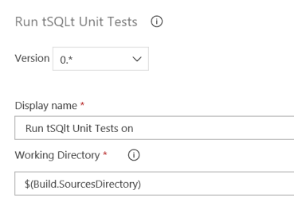

#### Database Information

Here, two required information:

* **SQL Server Connection String**: Make sure to test your connection string before using it here. A good source for connection strings is the [Connection Strings](https://www.connectionstrings.com/) website.

* **SQL Connection Timeout**: It's recommended to use 60 (seconds) as a timeout for your connection. Be careful not to add an amount of time here that could make your build stuck on your queue.

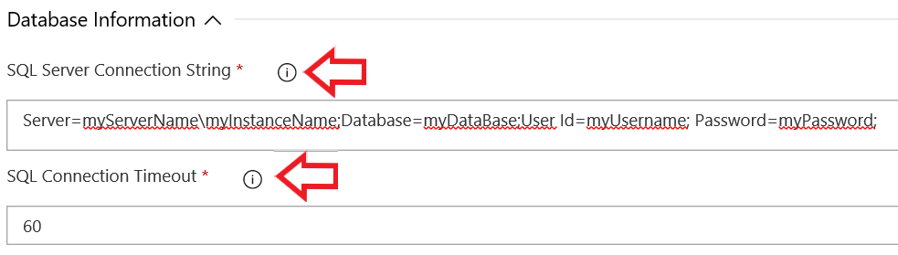

#### Test Execution

You'll have default information filled here. You can also customize it. You'll need these information for publishing your test results to your execution summary.

* **The root folder to store all the output for this task**: You must be aware that all the output from this task will be dropped under working directory\**out** (or whatever you configure here).

* **The name for the Test Results XML report**: This is the file that the Publish Test Results task will use to publish the results to the summary.

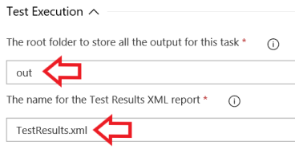

#### Code Coverage

By default, Code Coverage is **disabled**. If you want the task to also generate *Cobertura* code coverage reports, you must enable it. Remember that all those paths are relative to *working directory\root folder*

* **Folder to store the Open Cover generated source**: It will be useful to show detailed code coverage report.
* **The name for the Cobertura Code Coverage XML report**: You'll use this format to Publish Code Coverage report later.
* **HTML reports output**: You'll need to publish this folder as an artifact so it will be shown as part of the build summary.

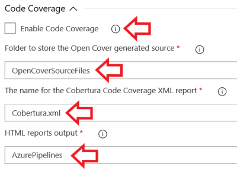

#### Control options

**VERY IMPORTANT**

If any of your tests fail, the task **will also fail**. Because of that, you *must* mark the *Continue on error* option so your pipeline will publish test results and code coverage reports, if enabled.

 
 ### Add the Publish Test Results to the pipeline

 To have the test results available on the pipeline summary, you must publish it. To do that, you just need to use the *Publish Test Results* task:

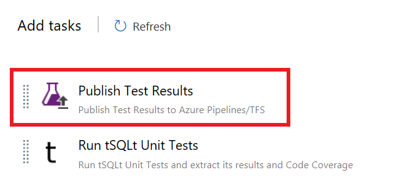

 #### Configure important parameters

 * **Test result format**: The test results tSQLt provides is JUnit based.
 * **Test results file**: The file name you configured on [The name for the Test Results XML report](#the-name-for-the-test-results-xml-report).
 * **Search folder**: It is the combination of the *working directory* and the *root output*. If you left everything default, it should be `$(Build.SourcesDirectory)/out`

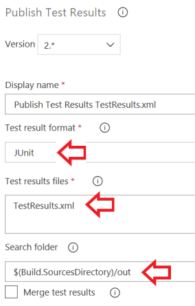

 ### Add the Publish Code Coverage Results task (if Code Coverage Enabled)

 If you [enabled Code Coverage](#code-coverage) on the Tests task, you'll need to publish its results to the pipeline summary.

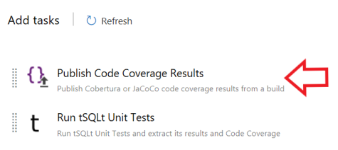

* **Code coverage tool**: You must select *Cobertura* as this task produces the results using this format.
* **Summary file**: The combination of *working directory*, *root output* folder and the file name you configured on [The name for the Cobertura Code Coverage XML report](#code-coverage).
* **Report directory**: The directory containing the [HTML reports output](#code-coverage).

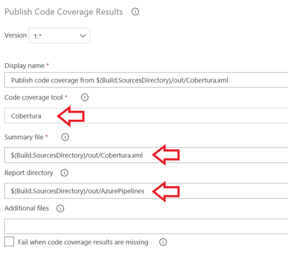

### Publishing the results as a Pipeline Artifact

*Note*: We're still using the *Copy and Publish Build Artifact* task, which is already deprecated. Once we test this task using the *Publish Pipeline artifacts*, we'll update this how-to.

You need to publish the HTML output to have the human-readable Code Coverage report available on the Pipeline summary.

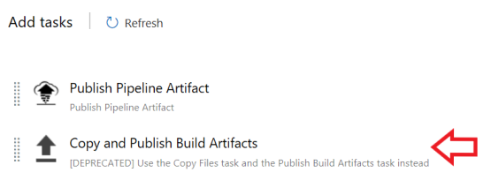

* **Copy root**: It is where the HTML reports are stored. It is a combination of *working directory*, *root output* and the [HTML reports output](#code-coverage).
* **Contents**: Just use the `**` wildcard and it will publish everything inside this folder and its subdirectories.
* **Artifact Name**: Important thing here. There's a pattern we must follow and it is `Code Coverage Report_[BuildId]`. To retrieve the build id, we can use the `$(Build.BuildId)` variable.
* **Artifact Type**: Must be *Server*.

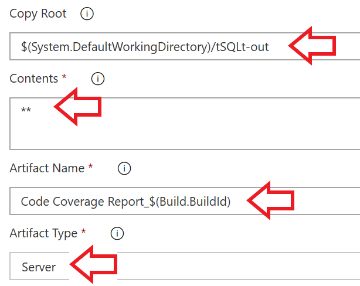